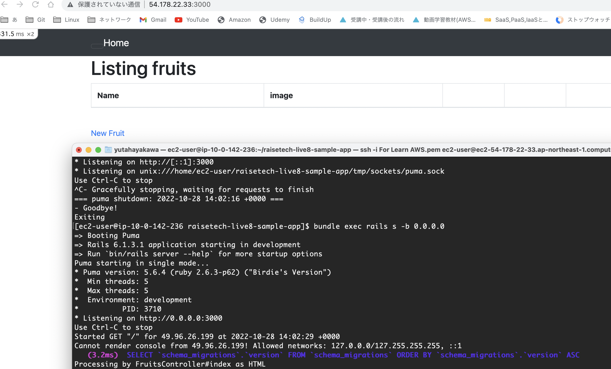
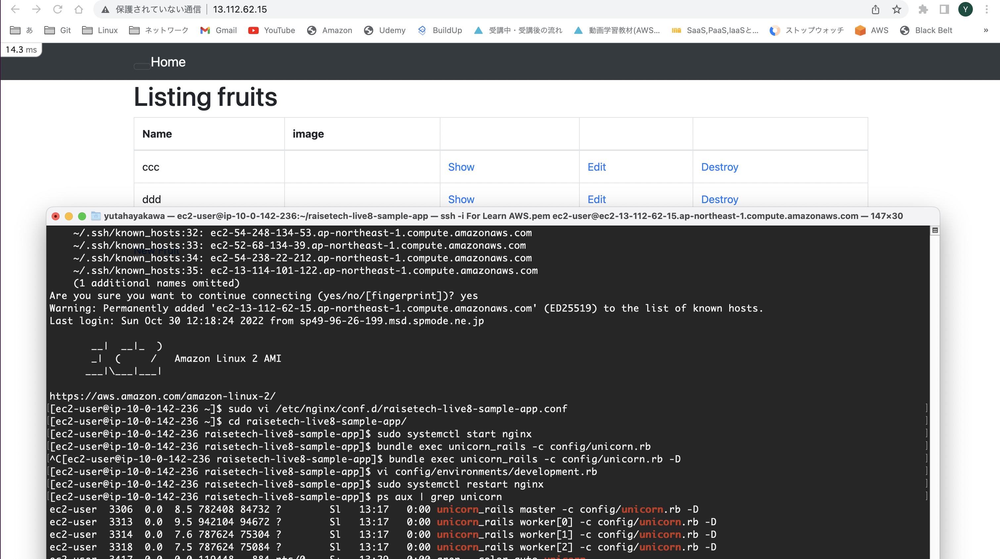
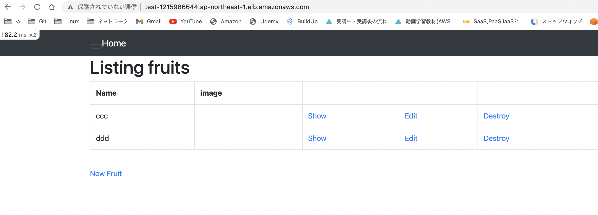
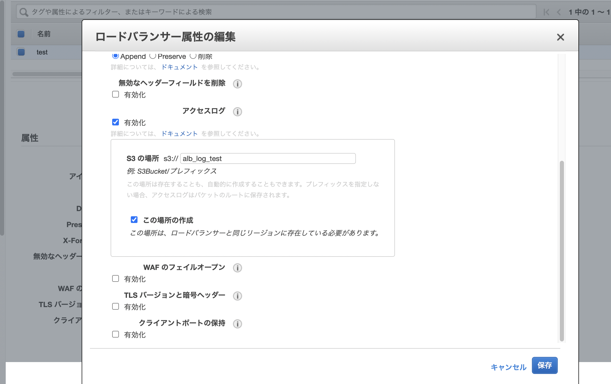
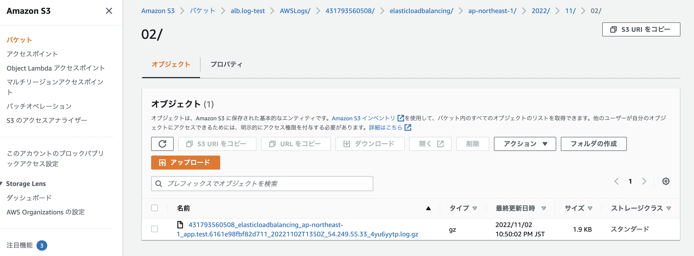
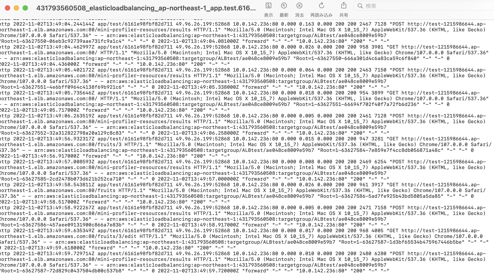

# 第5回課題
1. EC2上でサンプルアプリのデプロイ(**組み込みサーバー**)
2. EC2上でサンプルアプリのデプロイ(**Nginx+Unicorn**)
3. ELB(ALB)を噛ませて動作確認
4. S3の利用（どう利用するかは任意）
5. ここまでの構成図の作成  
<br>
<br>

## ①EC2上でサンプルアプリのデプロイ（**組み込みサーバー**）  

<br>
EC2にはRubyが標準ではインストールされていないので、まずRubyをインストールする。
<br>
まずはRubyのインストールに必要な各種モジュールをインストール（過不足があるかも）。
<br>
<br>

```txt
sudo yum -y install bzip2 gcc openssl-devel readline-devel zlib-devel gcc-c++
```
<br>
次に、Rubyのバージョン管理ツールのrbenvをインストール。
<br>
<br>

```txt
git clone https://github.com/sstephenson/rbenv.git ~/.rbenv

echo 'export PATH="$HOME/.rbenv/bin:$PATH"' >> ~/.bash_profile
echo 'eval "$(rbenv init -)"' >> ~/.bash_profile
source ~/.bash_profile
```
<br>
そしてRubyのインストールに必要なruby-buildをインストール
<br>
<br>

```txt
git clone https://github.com/rbenv/ruby-build.git ~/.rbenv/plugins/ruby-build
```
<br>
Rubyのインストール（今回のサンプルアプリを動作させるためバージョンは2.6.3とする）
<br>
<br>

```txt
rbenv install -v 2.6.3
rbenv rehash
rbenv global 2.6.3
```
<br>
次にサンプルアプリをgithubからクローンする
<br>
<br>

```txt
git clone https://github.com/yuta-ushijima/raisetech-live8-sample-app.git
```
<br>
サンプルアプリ上にディレクトリを移動させたあと、bundlerをインストールしバンドルインストール
<br>
<br>

```txt
Gem install bundler
Bundle install
```

node.jsとyarn、webpackerのインストール（node.jeのバージョンは14.20.1）
<br>
<br>

```txt
git clone https://github.com/creationix/nvm.git ~/.nvm
source ~/.nvm/nvm.sh
nvm install 14.20.1

npm install yarn -g

Bundle exec rails webpacker:install
```
※webpackerインストール時の質問はすべて「n（上書きしない）」とする
<br>
<br>
また、今回はRDSにDBを繋ぐのでサンプルアプリ上の /config/database.yml を弄る。
* User：RDSのエンドポイント
* パスワード：RDSのマスターパスワード
* socketファイルのパス：/var/lib/mysql/mysql.sock
<br>
<br>

そうしたら、DBを構築
<br>

```txt
bundle exec rails db:create
bundle exec rails db:migrate
```
<br>
ここまでくれば、あとは第3回講義のようにPuma（これが組み込みサーバー）を起動しアクセス確認。（このままだと仮想環境(VPC)外から接続できないので-bオプションで0.0.0.0を指定）
<br>

```txt
bundle exec rails s　-b 0.0.0.0
```

<br>
<br>
<br>
## ②EC2上でサンプルアプリのデプロイ（**Nginx+Unicorn**)
<br>
<br>
Nginxをインストール

```txt
sudo amazon-linux-extras install -y nginx1
```
<br>
Unicorn用の設定を行うため、/etc/nginx/conf.d/直下にconfファイルを作成
<br>

```
sudo vi /etc/nginx/conf.d/raisetech-live8-sample-app.conf
```
<br>
作成したconfファイルを編集
<br>

```
upstream unicorn_server {
  server unix:/home/ec2-user/raisetech-live8-sample-app/unicorn.sock;
  }

　# upstream ~ の ~ は下のproxy_passと同じ名称にする
  # server unix:のパスは、(サンプルアプリ)/config/unicorn.rbに記述されているsockファイルのパスと合わせる


    server {
        listen     80;
        server_name (Elastic IP);
        root       (サンプルアプリ直下)/public;

        client_max_body_size 2g;

        access_log  /var/log/nginx/access.log;
        error_log   /var/log/nginx/error.log;

        try_files $uri/index.html $uri @unicorn;

  location @unicorn {
    proxy_redirect off;
    proxy_set_header X-Forwarded-For $proxy_add_x_forwarded_for;
    proxy_set_header Host $http_host;
    proxy_pass http://unicorn_server;
   }

   location ^~ /assets/ {
            gzip_static on;
            expires max;
            add_header Cache-Control public;
            }


        # Load configuration files for the default server block.
        #include /etc/nginx/default.d/*.conf;

        error_page 404 /404.html;
        location = /404.html {
```
<br>
Nginxの起動

<br>

```
sudo systemctl start nginx
```
<br>
Unicornについては、今回はbundle install時にGemfileに含まれていたのでインストール済み。
特に/config/unicorn.rbを弄る必要はない（はず）。
<br>
<br>
Unicornの起動(-Dオプションでデーモン化)
<br>
<br>

```
bundle exec unicorn_rails -c /config/unicorn.rb -D
```
Elastic IPアドレスをブラウザに入力し、アクセス確認。
<br>



<br>
<br>
<br>

## ③ELB(ALB)を噛ませて動作確認
<br>
AWSのEC2のコンソール画面からロードバランサーを作成する前に、負荷を分散させる対象となるターゲットグループを作成。
<br>
今回は1つのEC2インスタンスだけのターゲットグループを作成した。
<br>
次にEC2のコンソール画面で「ロードバランサー」を選択し、ALBを作成する。

<br>

* SchemeとIP adress typeは今回はデフォルトのまま
* VPCはターゲットグループに含まれているインスタンスが属するVPC
* 少なくとも2つ以上のAZを選択（今回は-1aと-1c）
* セキュリティグループは、ALB用にインバウンドルールにタイプを「HTTP」、ソースを「0.0.0.0」とのみ記述したものを新規作成しアタッチする。
* リスナーIDは今回は「HTTP：80」とする

<br>
以上のように設定し、作成する。

<br>

作成後、ヘルスチェックがhealthyになっていることを確認し、ALBのDNS名でブラウザにアクセス。
<br>
するとエラーが出るので、 config/environments/development.rb を開き、end直前に
<br>
```txt
config.hosts << "DNS名"
```
と追記し、再度アクセスする。



<br>
<br>

## ④S3の利用（どう利用するかは任意）

<br>
ALBを導入したときにヘルスチェックでUnhealthyとなった。
<br>
原因を調べるためアクセスログを閲覧する方法を調べると、ロードバランサのアクセスログを確認するためにはS3バケットにに保存する必要があったので、アクセスログ保存のためS3を活用することとした。

<br>
ロードバランサの「説明」タブの下部にある「属性の編集」をクリック。
<br>
アクセスログを有効化し、新しいバケットを作成する。



<br>
S3のコンソール画面にアクセスすると、新しくバケットが作成されており、アクセスログが保存されている。ダウンロードし内容を確認することができる。

<br>





<br>
<br>
<br>

## ⑤ここまでの構成図の作成


<br>
<br>

## 感想

* 今までで一番ハードな課題だった。
* 課題を進めていく中で多くのエラーに出会ったが、とりあえずエラーログを確認してググれば大体は対処できると感じたので、エラー発生したらログを確認するのが大事だと感じた。
* 1つのサイトを参考にするだけではうまくいかないこともあるので、最低でも2〜3つのサイトを閲覧した方がよいと思った。
* AMIを作成しておくとミスってやり直したいときに便利。
