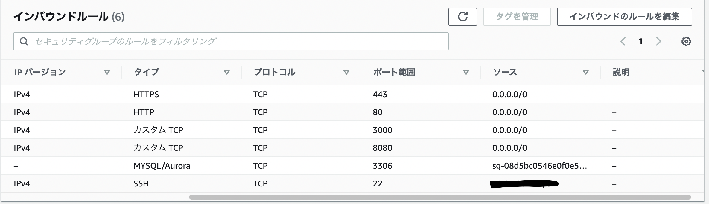
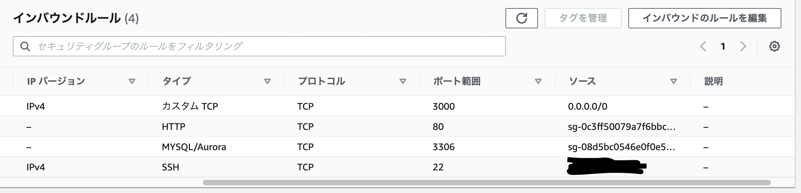

# 第7回課題提出

 
 

## ○自分で構築したAWS環境の中で脆弱性が認められる箇所とその対策について考察

 

第6回講義までで構築した環境の中で、脆弱性がある（かも）と思ったのは下記の3点。

 

1. ALBのリスナーにHTTPしか設定しておらず、HTTPS（SSL）通信ができていない
2. EC2のセキュリティグループのインバウンドルールにおいて不要なポートも空けている
3. **EC2とRDSを同一のサブネットに配置してしまっていた（追加）**

 

### **①ALBのリスナーにHTTPしか設定しておらず、HTTPS（SSL）通信ができていない**

 
＜現状＞
 
HTTP通信のみ設定しているので、外部との通信がセキュアになっていない。

 
＜対策＞
 
第7回講義でも取り上げられていたが、Route 53などでドメインを取得し、ACMでSSL証明書を発行後ALBにSSL証明書をアタッチする。そしてALBにHTTPSリスナーを追加し、ALBにアタッチされているセキュリティグループのインバウンドルールにHTTPSを追加すればインターネット→ALB間でHTTPS通信が可能となる。

 
 

### **②EC2のセキュリティグループのインバウンドルールにおいて不要なポートも空けている**

 
＜現状＞
 
インバウンドルールを下図のように設定している。ALBを噛ませているので、ALB→EC2のHTTP通信だけ許可すれば問題ないはずだが、HTTP（ポート番号80）とHTTPS（ポート番号443）、さらにPumaとUnicorn用に空けたポート番号3000と8080に関してあらゆるIPアドレスからの接続を許可してしまっている。

 

 

＜対策＞
 
インバウンドルールを編集し、必要最低限のポートだけ開けるようにした（下図参照）。
 
Puma用のポート番号3000は一応空けたままにしておいた。
 
この設定でも問題なくサンプルアプリにアクセスできた。

 

 
 

### **③EC2とRDSを同一のサブネットに配置してしまっていた**

 

＜現状＞

作成したEC2とRDSを同一のサブネットに配置してしまっていたことが判明した（しかもプライベートサブネット）。
 
そのサブネットにはインターネットゲートウェイをターゲットにしたルートテーブルがアタッチされているため、RDSに対し外部からのアクセスが可能になってしまっている。
 

※ルートテーブルの設定によってパブリックサブネットとプライベートサブネットが区別される。
 
上記のプライベートサブネットはインターネットゲートウェイをターゲットにしたルートテーブルがアタッチされているため実質的にはパブリックサブネットのようにふるまう。

 
＜対策＞

一度作成したEC2についてサブネットを変更することはできず、RDSのサブネットグループの変更もできなかったので（作成済のRDSで使用中のためらしい？）下記の手順でサブネットを分ける。（基本的にAZはap-northeast-1a）

 

1. 使用中のEC2を停止し、AMIを作成
2. 作成したAMIをベースに、パブリックサブネットにEC2を作成
3. プライベートサブネットだけのサブネットグループ（AZはap-northeast-1aとap-northeast-1c）を作成
4. 作成済のRDSのスナップショットから新規DBインスタンスを作成し、3.で作成したサブネットグループを紐つける
5. 関連するサブネットのルートテーブルの設定を変更
6. 新規に作成したEC2とRDSの接続確認および、ALBやCloudWatch、S3の設定やサンプルアプリでの設定ファイルを変更

 

これにより、EC2をパブリックサブネット、RDSをプライベートサブネットに配置し直した上でルーティングも適切に設定することができた。（サンプルアプリへのアクセスも確認）

 
 

## 感想

 

* セキュリティに関するAWSサービスは多種多様なので、クライアントのニーズに合わせて使い分け・提案できるようになった方がよいと思った。

* わからないワードなどを調べながら講義の内容を復習したい。まずはセキュリティの根本的な考え方から。

 