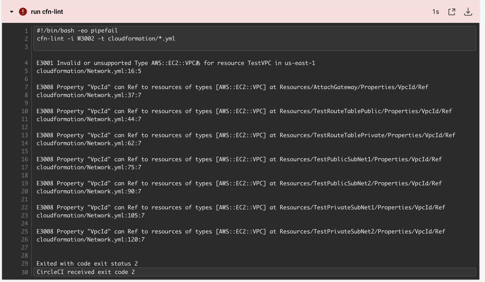

# 第12回課題報告

* 課題用のリポジトリにcircleciを導入する
  
<br>
<br>

公式ドキュメント通りに操作してもよかったのだが、課題用のリポジトリにcircleciを導入する際にはちょっとやり方を変えてみた。  
まずローカルリポジトリでブランチを切って
```.circleci/config.yml```を作成し、サンプルの記述をコピペした。


<br>
そしてリモートリポジトリにプッシュするとcircleciが起動したが、cloudformationフォルダを作成していなかったのでエラーが発生した。

<br>


<br>
<br>

そこで、リモートリポジトリにcloudformationフォルダおよび以前作成した
```Network.yml```を追加した。

<br>


<br>


サンプルの```.circleci/config.yml```では、「cloudformationフォルダ内のymlファイルの構文エラーをcfn-lintでチェックする」というjobが定義されており、以前作成したymlはVScodeの拡張機能（これもcfn-lint）で構文エラーがないことを確認済みなのでこのままだとテストが成功するはず。  
なので、
```Network.yml```を編集して意図的にエラーを発生させてみた。（下図の通り、TestVPCリソースのType:を「AWS:::EC2:::VPCあ」とした）


<br>

この状態でリモートリポジトリにプッシュすると、ちゃんと構文エラーが発生したことがわかった。

<br>



<br>

ちゃんと動作することがわかったので、構文エラーがでないようにymlファイルを再編集したあと再度リモートリポジトリにプッシュすると、今度はテスト成功した。

<br>


