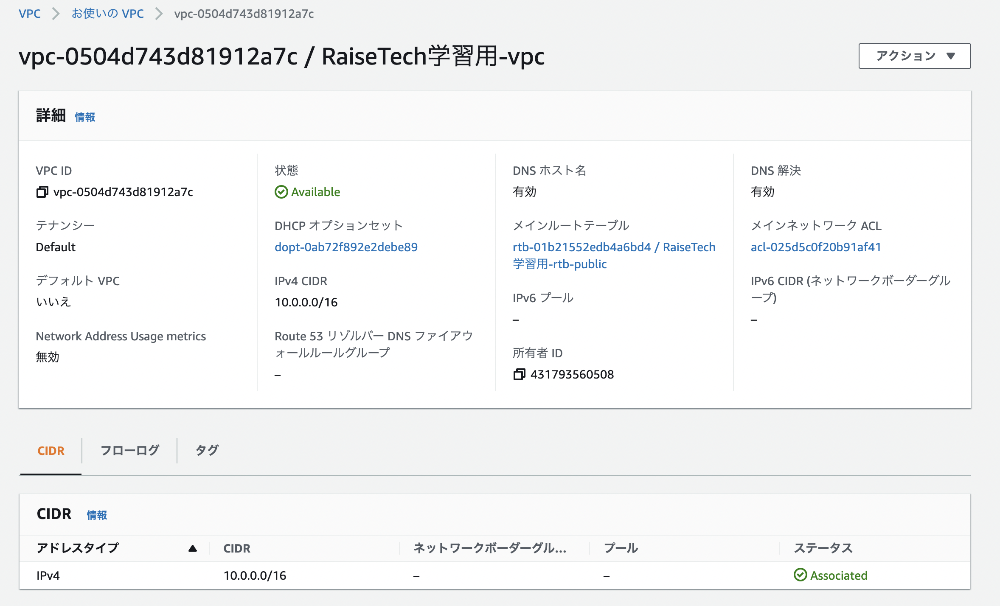
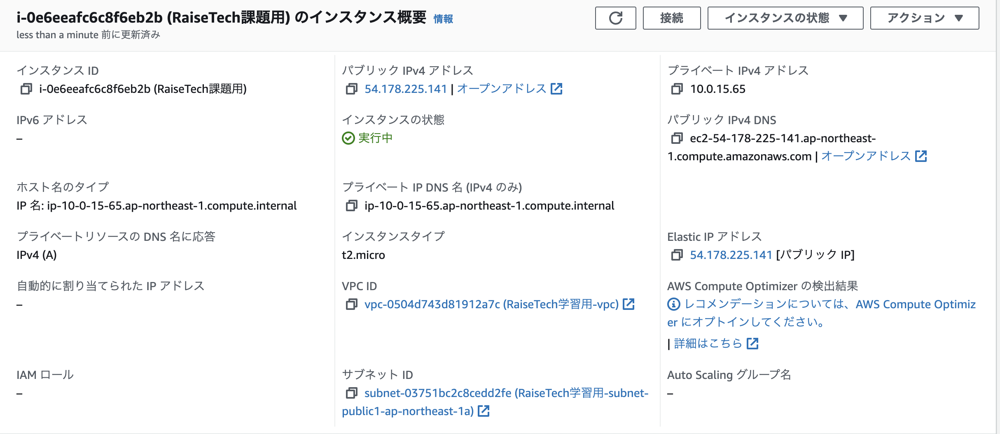
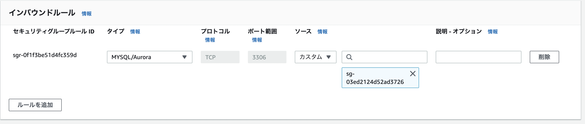
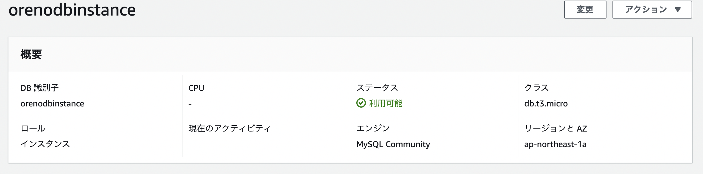
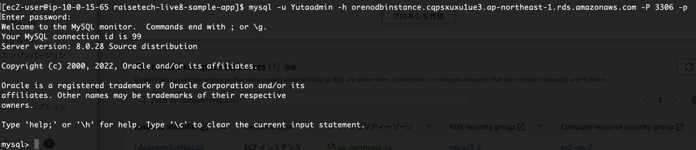

# 第4回課題報告

1. 新規VPCの作成
2. EC2とRDSの構築
3. EC2とRDSの接続確認

<br>
<br>

## ①新規VPCの作成

<br>

VPCのマネジメントコンソール画面にある「VPCを作成」を押下すると設定ウィザードが開くのでそこから作成する。  
<br>
※コンソール画面右上に表示されているリージョンにVPCが作成されるので適宜変更すること。

<br>

デフォルトの設定だと、VPCの他に下記の4つが自動で作成される。
* AZが2つ
* それぞれのAZにプライベートサブネットとパブリックサブネットが1つずつ
* パブリックサブネット用とプライベートサブネット用のルートテーブルが計3つ
* インターネットゲートウェイが1つ

この他、CIDRブロックは適宜変更してもよい。NATゲートウェイは有料なので今回はなしにした。  
また、タグについてはリソースの関連付けのため設定してあげた方がよいだろう。  
<br>
以上の設定でVPCを作成した。  
<br>


<br>
<br>

## ②EC2とRDSの構築

<br>
まずEC2から作成する。  
<br>
VPCのときと同様、EC2のマネジメントコンソール画面にある「インスタンスを起動」を押下すると設定ウィザードが開くのでそこから各種項目を設定する。  

<br>
今回は無料利用枠におさめるため下記のように設定した。

<br>

* マシンイメージ→「Amazon Linux 2 Kernel 5.10 AMI 2.0.20221004.0 x86_64 HVM gp2」
* インスタンスタイプ→t2.micro
* キーペアは新規に作成したものを使用
* 先程作成したVPCのパブリックサブネット上に作成（パブリックIPの自動割当も有効にする）
* ストレージはデフォルトのまま（gp2タイプの8GiB）
* 高度な詳細は変更せずそのまま
* セキュリティグループは新規作成し、インバウンドルールを下記のように設定したものをアタッチ(3000番ポートを空けているのは、後の課題でrailsのPumaを起動するため)。

<br>
<br>


<br>

上記の設定でEC2を作成。

<br>
<br>



<br>
<br>

次にRDSの作成。  
RDSについてもコンソール画面の「データベースを作成」から設定ウィザードに沿って作成する。

<br>
<br>
今回は無料利用枠におさめるため下記のように設定した。

<br>

* DB作成方法は「標準作成」とする。
* DBエンジンはMySQL（バージョンはMySQL8.0.28）
* テンプレートは「無料利用枠」とする
* DBインスタンス識別子、マスターユーザー名、マスターパスワードは適宜
* DBインスタンスクラスは「db.t3.micro」
* ストレージはgp2タイプの20Gib
* 「接続」の欄では、「EC2コンピューティングリソースに接続しない」とし、VPCは先程作成したVPCを指定する。また、パブリックアクセスは「なし」にする。アベイラビリティーゾーンは任意のAZを選択する。
* セキュリティグループは、RDS用のものを以下の画面のように新規作成しアタッチする。（ソースは先程作成したVPC用のSGを選択）

<br>



<br>
<br>

* データベース認証はデフォルトのパスワード認証とする。
  
<br>
※テンプレートを「無料利用枠」とすると単一AZしか選択できなくなり、インスタンスクラスも無料利用枠で使用可能なものしか選択できなくなる。

<br>

また、「追加設定」タブでは「最初のデータベース名」で適当な名前を指定しておくほか、「ログのエクスポート」で各種ログの吐き出しを有効化しておく。

<br>
以上の設定でデータベースを作成。

<br>
<br>



<br>
<br>
このままだと接続できないので、先程作成したEC2のセキュリティグループに、タイプを「MySQL/Aurora」、ソースをRDS用に作成したセキュリティグループにしたアウトバウンドルールを追加する。  

<br>
<br>
<br>

## ③EC2とRDSの接続確認

<br>
<br>
まず、作成したEC2インスタンスにSSHで接続する。  

```txt

ssh -i "作成したキーペア" ec2-user@ec2-"パブリックIP".ap-northeast-1.compute.amazonaws.com
```

EC2に接続できたら、MysqlをEC2インスタンスにインストールする。（第3回目講義でCloud9上にインストールした方法と同じように行えば良い）

<br>
ここまできたら、下記のコマンドでEC2とRDSを接続させる。  

パスワードの入力を求められるので、DB作成時に設定したマスターパスワードを入力すればDBに接続できる。

<br>

```txt

mysql -u マスターユーザー名 -h RDSのエンドポイント -P 3306　-p
```

<br>
<br>




<br>
<br>
<br>


## 感想

<br>

* mysql接続の際に、セキュリティグループの設定が適切ではなかったため接続がうまくいかなかった。セキュリティグループの考え方・定義をちゃんと復習したい。
