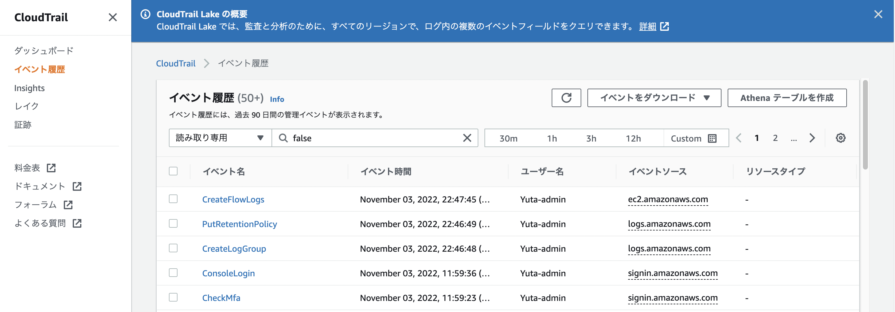
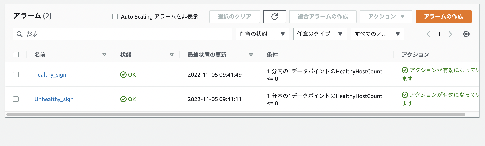
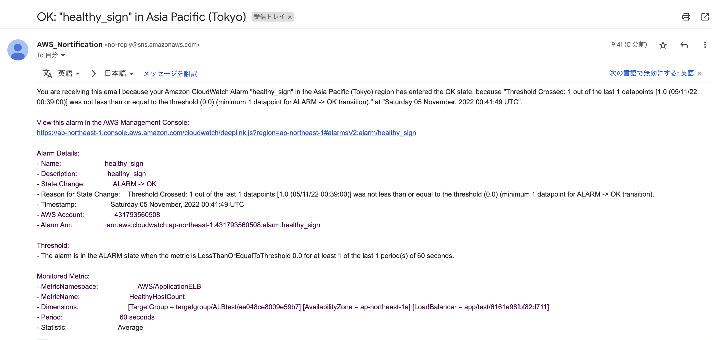
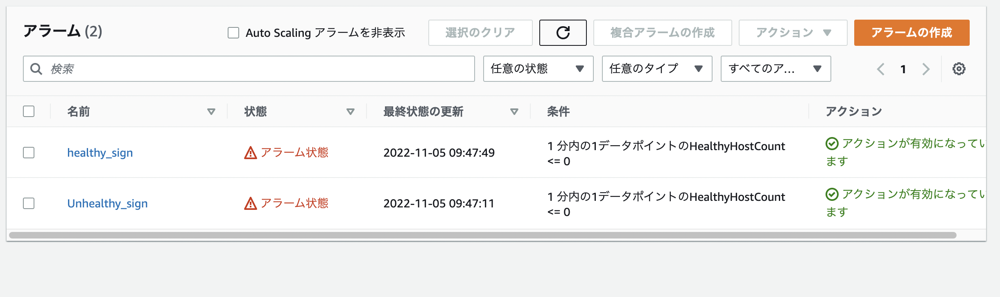
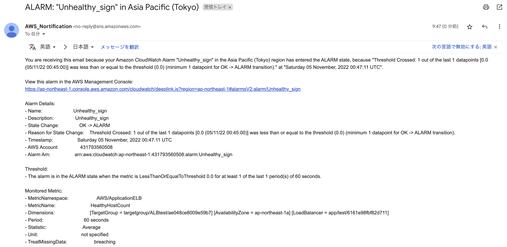
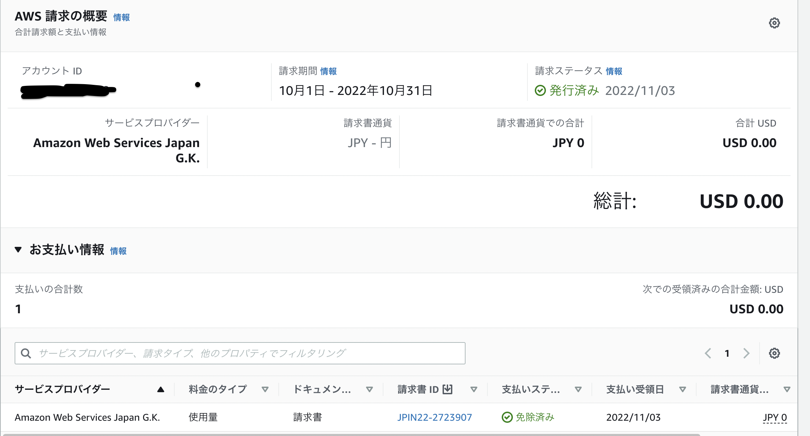

# 第6回課題報告
1. CloudTrailで最新の記録を3つピックアップ
2. CloudWatchアラームでhealthy時とunhealthy時のアクションをそれぞれ設定し、  
   Amazon SNSでメール通知されるようにする
3. AWSで今までに作成したリソースの見積を作成
4. マネジメントコンソールから現在の利用料を確認

 
 

## ①CloudTrailで最新の記録を3つピックアップ

 

 
記録を確認した22年11月3日22時53分時点での最新のイベント3つは、

 

1. CreateLogGroup
2. PutRetentionPolicy
3. CreateFlowLogs

 

となっていた。

 

いずれも第6回講義で取り上げられていたVPCフローログを取得できるように設定した過程で発生したイベントであろう。
 
それぞれのイベントが指している内容は以下の通り（と思われる）。

* CreateLogGroup &nbsp;&nbsp;&nbsp;&nbsp;&nbsp;&nbsp;&nbsp;→ ロググループの作成
* PutRetentionPolicy　→ ログ保存期間の変更
* CreateFlowLogs &nbsp;&nbsp;&nbsp;&nbsp;&nbsp;&nbsp;&nbsp;→ VPCフローログの作成

 
 

## ②CloudWatchアラームでhealthy時とunhealthy時のアクションをそれぞれ設定し、  Amazon SNSでメール通知されるようにする

 
 

まずはAmazon SNSで「トピックの作成」からトピックを作成する。
 
今回は通知用のメールアドレスを新規作成し、そのアドレスをサブスクリプションのエンドポイントに指定した。

 
次に、CloudWatchアラームの作成。
 
まずは講義でも取り上げられた、ALBのヘルスチェックでhealthy→unhealthyになったときにメール通知が飛ぶようにするアラームを作る。

 

CloudWatchのコンソールから「アラームの作成」をクリックし、「HealthyHostCount」のメトリクスを選択。（ターゲットグループとロードバランサーを正しく指定するようにする）
 
メトリクスと条件を、下記のように設定する。

 

* 統計は「平均値」
* 期間は「1分」
* 閾値の種類は「静的」
* アラーム条件は「0以下」

 

次画面では、アラーム状態トリガーを「アラーム状態」とし、先程作成したSNSトピックを通知の送信先に指定。その他はデフォルトのままとし、次にアラームの名前を決めてアラームの作成が完了。

 
今回はOKアクション（ALBのヘルスチェックでUnhealthy→Healthyになったときのアクション）も設定するので、上記で作成したアラームをコピーし、アラーム状態トリガーだけ「OK」に変更したアラームも作成。

 
2つのアラームを作成した時点ではrailsアプリを起動しておらずALBがunhealthyの状態だったので、railsアプリを起動してALBをhealthyの状態にしてみると2つのアラームの状態が「OK」となり、OKアクションが作動しhealthyになったことを通知するメールを受信した。

 

 

 

次に、railsアプリを停止させALBをunhealthyの状態にすると、2つのアラームの状態が「アラーム状態」になり、unhealthyになったことを通知するメールを受信した。

 

 

 
 
 

## ③AWSで今までに作成したリソースの見積を作成

 

AWS上で今までに作成したリソースは下記の5つ

 

* VPC
* EC2
* RDS
* ELB(ALB)
* S3

 

このうち、VPCはVPNやNATゲートウェイなどのオプションを利用しない限り無料で使用でき、オプションは現段階では利用していないためEC2・RDS・ALB・S3の4つのリソースについて見積を作成した。

 

見積条件は、基本的に現在使用している無料枠のスペックに準拠した。
 
利用時間に関しては、下記の通りの設定にした。

 

* EC2はElastic IPを利用しているためフル稼働（使用率100％）
* RDSは週20時間（週の平均勉強時間と合わせた）

 

また、ELB(ALB)に関しては、ALBの実行時間の他にロードバランサーキャパシティーユニット (LCU) の使用量に応じても料金が発生する。
 

下記の4項目に対して1LCU当たりの「基準値」が設定されており、その「基準値」と「想定の使用量」の割合を各項目で計算する。そして、各項目の計算結果の中で最も大きい数値に0.008USDを乗じて1時間当たりのLCU使用料金が決まる。（[参考リンク](https://qiita.com/hokutoasari/items/26c64dc351c3b9cdedd4)）

 

* 1 秒あたりの新たに確立された接続の数
* 1 分あたりのアクティブな接続の数
* ロードバランサーによって処理された HTTP(S) リクエストと応答のバイト数 (GB 単位)
* ロードバランサーにより処理されたルールの数とリクエストレートの積（最初に処理される 10 個のルールは無料）

 

今回は、[公式ドキュメント](https://aws.amazon.com/jp/elasticloadbalancing/pricing/)に記載されている例1に基づいてLCUの使用量を見積もることとした。

 

S3に関しては、ストレージ使用量・データ転送量・リクエスト数に応じて料金が変わるが、現在の利用の仕方（ALBとCloudTrailのログ取得）だとデータ転送量とリクエスト数は0で、ストレージ使用量も月250KB程度なので見積料金は0USDとなったが見積には一応含めた。

 

トータルの見積結果は[こちら](https://calculator.aws/#/estimate?id=df3f48d4721c71bd9a54ac7e5cb079546654af52)

 
 
 

## ④マネジメントコンソールから現在の利用料を確認

 
先月（22年10月）の利用料金は無料枠内だったため0円であった。
 
無料枠を超えそうになったらメール通知が飛ぶように設定していて、メール通知がなかったので無料枠におさまっていたということだろう。

 

 
 

## 感想

 

* リソースの料金を見積もるときには考慮しなければいけない事項が多く、慎重に検討する必要があると感じた。
